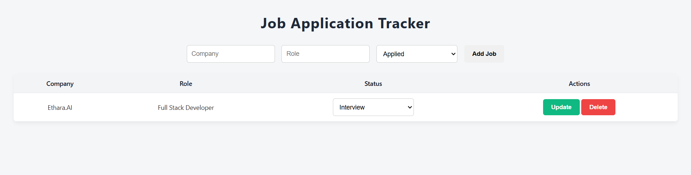

# Job Application Tracker

## Project Overview
A full-stack **Job Application Tracker** to **add, list, update, and delete job applications**. Built using **Python (FastAPI)**, **SQLAlchemy**, **SQLite**, and **vanilla HTML/CSS/JavaScript**. This application demonstrates **end-to-end full-stack functionality**, including frontend-backend integration, data validation, and CRUD operations. 

## Tech Stack
- **Backend:** Python, FastAPI, SQLAlchemy  
- **Frontend:** HTML, CSS, JavaScript  
- **Database:** SQLite  
- **Deployment:** Render (backend), Netlify (frontend)  

## Features
- Add new job applications (company, role, status)  
- List all jobs in a table  
- Update job status (Applied / Interview / Offer / Rejected)  
- Delete job applications  
- Responsive, clean, and professional UI  
- Full frontend-backend integration  
- CORS enabled for cross-origin requests  

## Steps to Run the Project Locally

### 1.Clone the repository
git clone https://github.com/Nimishakeshan/job-application-tracker.git

### 2.create virtual environment
python -m venv venv (This will only run if python is installed,check python version : python --version)
To activate virtual environment - venv\Scripts\activate

### 1.Starting backend

### 3.cd backend 
### 4.pip install -r requirements.txt
### 5.uvicorn main:app --reload
This will run backend at local host: 8000 (remember to change API url to run locally to this : http://127.0.0.1:8000 not deployed one).

### 2.Starting frontend
###1. Go to index.html and run it with live server extensions. The Web page will be live and fully functional

### Test End-to-End

Add a job → table updates
Update job status → and click on update, table updates
Delete job → removed from table

